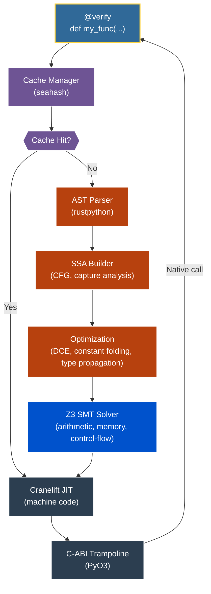

# Lirien Documentation Hub

Welcome to the official documentation for **Lirien**, a verifying JIT compiler for a safe subset of Python using Z3 and Cranelift.

Lirien treats type annotations as formal mathematical specifications, uses an SMT solver to prove their safety at compile time, and then JIT-compiles them directly to native machine code—bypassing the CPython interpreter and the GIL.

---

## Documentation Sections

Explore the different facets of Lirien:

*   **[Getting Started & Installation](getting_started.md)**: Setup prerequisites, compile the Rust core, install the Python extension, and run tests.
*   **[Core Concepts & Verification Contracts](core_concepts.md)**: Refinement types, the `V` placeholder DSL, Design by Contract (`assert`), and inductive recursive proofs.
*   **[Performance & Monomorphization](performance_dispatch.md)**: Static dispatch via `Protocol`, GIL-free parallelism, flow-sensitive type narrowing, const generics, multiple dispatch, and SIMD.
*   **[Data Structures & Memory Layouts](data_structures.md)**: Flat C-ABI structs, stack-allocated value types, ADTs, `TypedDict`, growable `List` arrays, Tensors with kernel fusion, and zero-copy buffer slicing.
*   **[Developer Tooling & Diagnostics](developer_tooling.md)**: Bypassing verification via `@jit`, the thread-local `no_verification()` block, hierarchical subsystem `tracing()`, and source-level diagnostic diagnostics.
*   **[Architecture & Compiler Pipeline](architecture_pipeline.md)**: The internal representation (SSA IR), caching pipeline, formal Z3 encoding, and Cranelift backend execution.
*   **[Experimental `num` Standard Library](stdlib_num.md)**: JIT-compiled, SIMD-accelerated, and Z3-verified operations for numerical computing, convolutions, activations, and model training.

---

## High-Level Overview

