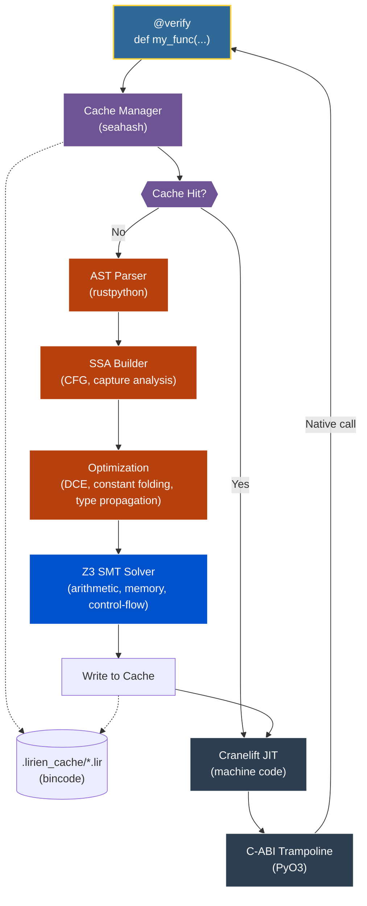

# Architecture & Compiler Pipeline

Lirien is designed as a modular compiler. It converts Python source code into a custom Static Single Assignment (SSA) intermediate representation (IR), formally verifies it using Z3, and compiles the verified bytecode to machine code via Cranelift.

---

## High-Level Pipeline

---

## Detailed Compilation Stages

### 1. Interception & Hashing (`lirien-bridge`)
The `@verify` decorator intercepts the Python function object at load time. The compiler extracts its source text, parameter types, signature, and active compiler metadata. These details are hashed into a unique key using `seahash`.

### 2. AOT Cache Lookup
The compiler searches `.lirien_cache/` for a pre-compiled `.lir` binary matching the hash key.
*   **Cache Hit:** The compiled machine code is loaded directly into executable memory (Stage 6), completely bypassing Z3 and Cranelift overhead.
*   **Cache Miss:** Proceed to AST compilation.

### 3. AST Lowering to SSA IR (`lirien-ir`)
The Python AST is parsed via `rustpython-parser` and analyzed. The SSA builder generates control flow graphs (CFGs), performs lexical scope resolution, and identifies captured variables for closures.

### 4. Middle-end Optimization
Lirien runs several optimizer passes to simplify the SSA IR:
*   **Dead Code Elimination (DCE):** Prunes unreachable basic blocks and unused variables.
*   **Constant Folding:** Computes constant math (e.g. `2 + 2`) statically.
*   **Type Propagation:** Infers types across operations to minimize runtime type-checking assumptions.

### 5. Formal Verification (`lirien-verify`)
The SSA instructions are converted to Z3 expressions. 
*   **Safety Checking:** Z3 proves the safety of index offsets, asserts, pointer loads/stores, and division operations across all paths.
*   **Refinement Type Analysis:** Refinement types are checked against variable constraints. If any path can violate a precondition or postcondition, the compilation is aborted and a compile error is raised.

### 6. Code Generation (`lirien-backend`)
The verified SSA IR is mapped to Cranelift IR instructions. Cranelift's JIT compiles the bytecode directly to native machine instructions placed inside a read/execute memory page.

### 7. Trampoline Installation
Using PyO3, the compiler creates a lightweight C-ABI trampoline that acts as the `__call__` interface for the Python function object. Subsequent Python calls jump straight into the JIT memory buffer, bypassing the interpreter completely.
